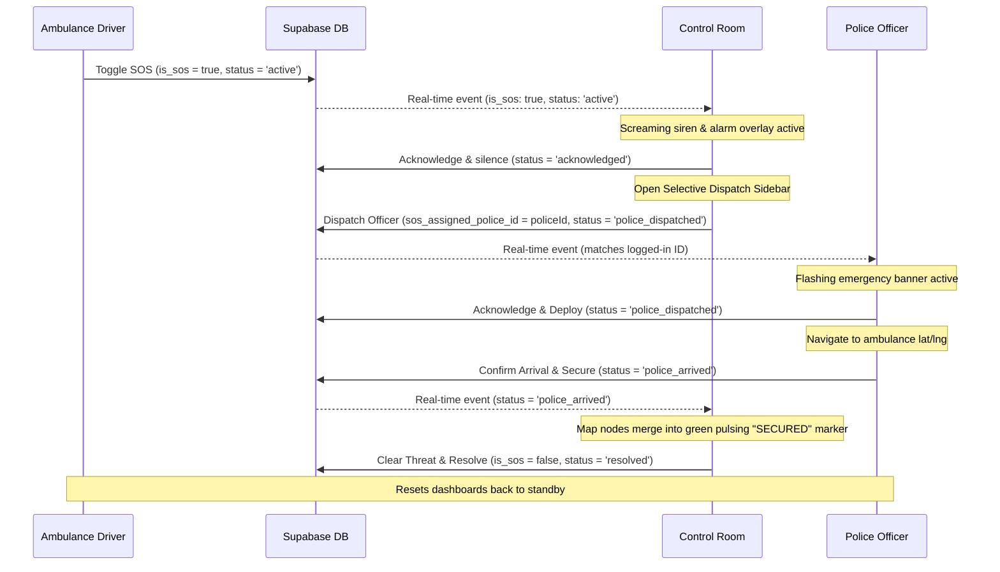

# Design Specification — Panic SOS Real-Time Police Dispatch & Guarding

This document outlines the end-to-end design and real-time synchronization architecture for the **Panic SOS** emergency escalation flow. It connects the Ambulance Driver, the Control Room Operator, and the Police Patrol Officer in a closed real-time feedback loop.

---

## 1. Objectives & Lifecycle States

When an ambulance driver triggers a **Panic SOS**, the system escalates the situation in real-time, facilitating operator dispatch of nearby police units and tracking the deployment from dispatch through arrival and scene security.

The operational flow goes through five synchronized states:
1. `active`: The driver triggers the SOS. A screaming siren and full-screen alarm overlay take over the Control Room.
2. `acknowledged`: The Control Room silences the siren and opens the selective dispatch panel.
3. `police_dispatched`: The operator selects and dispatches an online police officer. The officer receives an urgent override notification and acknowledges the deployment.
4. `police_arrived`: The police officer reaches the distressed ambulance and confirms arrival. The scene is marked as **SECURED**.
5. `resolved`: The threat is resolved, and the dashboards return to normal standby operation.

---

## 2. Database Schema Extension (`migration_v7.sql`)

The `ambulance_units` table is extended to support these lifecycle phases:

```sql
-- Extend ambulance_units with SOS lifecycle columns
ALTER TABLE public.ambulance_units ADD COLUMN IF NOT EXISTS sos_status TEXT CHECK (sos_status IN ('active', 'acknowledged', 'police_dispatched', 'police_arrived', 'resolved'));
ALTER TABLE public.ambulance_units ADD COLUMN IF NOT EXISTS sos_assigned_police_id UUID REFERENCES public.police_profiles(id) ON DELETE SET NULL;
ALTER TABLE public.ambulance_units ADD COLUMN IF NOT EXISTS sos_updated_at TIMESTAMPTZ DEFAULT NOW();

-- Enable updates to ambulance units so police officers can update SOS status upon arrival
DROP POLICY IF EXISTS "Police Officer Update Ambulance SOS" ON public.ambulance_units;
CREATE POLICY "Police Officer Update Ambulance SOS" 
ON public.ambulance_units FOR UPDATE 
USING (true)
WITH CHECK (true);
```

---

## 3. End-to-End Real-Time Coordination Flow



---

## 4. Component Level Specifications

### A. Ambulance Dashboard (`AmbulanceDashboard.tsx`)
- **State Trigger**: Toggling the Panic SOS button updates the `ambulance_units` table with `is_sos = true` and `sos_status = 'active'`.
- **Status Feed**: Renders a glassmorphic info bar above the controls displaying the exact state of help:
  - `active`: *"Emergency signal broadcasted. Waiting for dispatcher..."* (crimson pulsing border)
  - `police_dispatched`: *"Officer [Name] dispatched. En route to your position..."* (amber pulsing border)
  - `police_arrived`: *"Officer [Name] has arrived. Scene SECURED & guarded."* (emerald glowing border)

### B. Control Room Dashboard (`LiveOperations.tsx`)
- **Fullscreen Siren Overlay**: Kept intact but updated with an **"Acknowledge & Dispatch Police"** action.
- **Dispatch Drawer**: Displays all online officers (`police_profiles.is_online = true`) sorted by distance to the distressed ambulance. Lists badge numbers, distance, and an action button to dispatch.
- **Top SOS Bar**: Stays pinned to the top of the command center showing current status (`Dispatched` / `Guarding`) once the screaming alarm is silenced.
- **Tactical Map (Leaflet)**:
  - **En Route**: Draws a pulsing orange line from the officer's shield to the ambulance's coordinate.
  - **Secured**: When `police_arrived`, the ambulance and officer markers are merged into a single glowing green node with a shield icon.

### C. Police Dashboard (`PoliceDashboard.tsx`)
- **Urgent Notification Bar**: Slides down over the entire screen when the officer's ID is set in `sos_assigned_police_id`.
- **Active Escort Card**:
  - Displays the target ambulance's ID, current speed, and real-time distance.
  - Button **"Acknowledge & Deploy"**: Signals that the officer is en route.
  - Button **"Confirm Arrival & Secure"**: Updated once they reach the ambulance, setting the status to `'police_arrived'`.
- **Leaflet Map**: Traces a route to the ambulance's live GPS coordinates.
